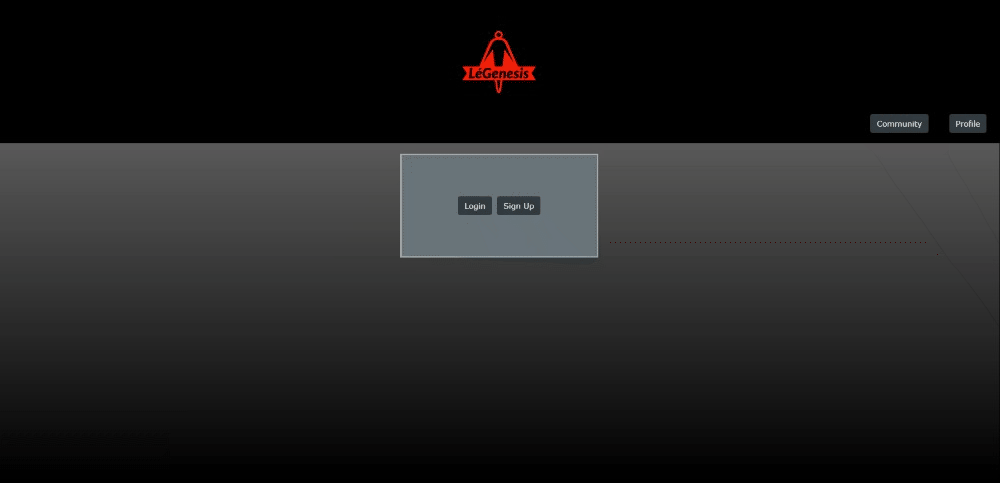

# LéGenesis

## Table of Contents

- [Description](#description)
- [Installation and Deployed Site](#installation-and-deployed-site)
- [Technologies Used](#technologies-used)
- [Usage and User Stories](#usage-and-user-stories)
- [CSS Framework Details](#css-framework-details)
- [Preview](#preview)
- [Contact](#contact)
- [License](#license)

## Description

A joint effort to create a simple and fun method of creating characters and sharing them with others, allowing creative minds to attach details to their beloved creations.

## Installation and Deployed Site

[Visit the deployed site here!](https://legenesis.herokuapp.com/)
<br/>
To install the app locally:

- Ensure that Node.js is installed on your local machine
- Ensure that MySql is installed on your local machine
- [Create a free account on Cloudinary if you don't have one already](https://cloudinary.com/)
- After creating a Cloudinary account, navigate to your dashboard to check your Cloudinary Cloud Name, API Key, API Secret, and API Environment variable
- Clone the GitHub repo to your local machine
- Modify the ".env.EXAMPLE" file to just be named ".env", input the MySql credentials into "DB_USER" and "DB_PASSWORD" respectively, and input the Cloudinary credentials into "CLOUDINARY_URL", "CLOUD_NAME", "CLOUD_API_KEY", and "CLOUD_API_SECRET", respectively
- Use your local machine's command-line to navigate to the cloned repo's directory
- Using either MySql Workbench or the MySql shell, run the schema.sql file and then return to the normal command-line of your choice
- Run "npm install"
- If you want to view the sample data we've included, run "npm run seed" in the command-line
- After running seed, you may login into a sample guest account with email "peter@hotmail.com" and password "password"
- Run "npm start"
- Visit http://localhost:3001/ in your browser of choice

## Technologies Used

- HTML
- CSS
- Javascript
- jQuery
- Fetch
- Bootstrap
- Google Slides (wireframe)
- Session and Cookies Storage
- Node
- NPM
- Express
- MySQL
- Sequelize ORM  
- Bcrypt
- Handlebars
- Cloudinary NPM Package
- Cloudinary Third-party API

## Usage and User Stories

After first visiting the site for the first time, a creative user may choose to either log in to an existing account, or sign up for a brand new account. After inputting their credentials, the server listens via a POST request to see if the user may be logged in or granted a brand new account. Upon correct credentials, the user is first greeted to a list of all users, as well as a navigation bar now populated with the buttons of "Community", "Profile", and "Logout". Clicking on any of the users within the user list redirects the inquisitive mind to that user's own listing of characters. This action is performed thanks to an API GET route, which then returns all of the server-side character data to the front end. In addition, this relationship can only be formed via the MySql model secretly stored on the server-side, which dictates that a single User may own many Characters, but a Character may only belong to a specific User. The potential creator may return to the user list any time with the "Community" button, which redirects back to the user list. When the creator is ready to finally create a character, they may click the "Profile" button to view their own currently existing list of characters, and then the newly appeared "New Character" button to begin the process of creating a character. On the character creation screen, the creator is presented with a number of input fields, all to fill in data about the character's Alignment, Name, Physical Description, Backstory, Personality, Abiltities, and even a button to upload an image of the character. After clicking "Upload Image", a handy upload widget, formed by Cloudinary's NPM package, pops up and prompts the user a number of available methods to upload a picture. After choosing a picture to upload, the server discreetly uploads the image to the Cloudinary data storage cloud via an API call, and then sends back the uploaded image's url for use with the site. When all fields have valid information, the creator may hit the large "Save Character" button at the bottom of the page, a POST request is sent to the server-side API, which then saves the newly formed character to the creator's unique ID within the database. Resultantly, the new character may now be viewed by all users, associated with the specific creator. When the user wishes to take a break from browsing and creating characters, the user may hit the "Logout" button at any time, which performs a POST request to the API to terminate the session, automatically redirecting the creator back to the landing page.

## CSS Framework Details

We utilized Bootstrap, specifically [Bootstrap version 4.5](https://getbootstrap.com/docs/4.5/), the CSS framework that serves as a powerful tool for designing applications professionally and easily. After linking Bootstrap's CSS and JS links into our handlebars--which of course means the framework is perfectly functional with traditional HTML as well--a number of prebuilt classes instantly become available for use anywhere in the HTML. In addition, the classes are flexible enough to be further modified in our own local CSS file when needed. Bootstrap utilizes a grid system, allowing simple organization of elements by assigning them to specific rows and columns. We also utilized their handy button styling for buttons throughout the site, as well as their prebuilt modals. Additionally, Bootstrap is built with mobile devices in mind first, ascertaining the elements comfortably fit on all screen sizes.
<br/>
Below is a demo of the dynamic screen sizing of our website, powered by Bootstrap.
<br/>


## Preview


<br/>
```
router.post('/login', async (req, res) => {
    try {

        // user data is searched for within the database
        const userData = await User.findOne({ where: { email: req.body.email } });

        // if user's email is not found within the DB, return a 400 error
        // for security reasons, website does not specify if it was specifically the email or the password that was incorrect
        if (!userData) {
            res
                .status(400)
                .json({ message: 'Sorry, incorrect email or password was entered. Please try again with valid credentials.'} );
            return;
        }

        // check user's inputted password to see if its hashed equivalent is in the DB
        const validPw = userData.checkPassword(req.body.password);

        // if password is wrong, return a 400 error
        // for security reasons, website does not specify if it was specifically the email or the password that was incorrect
        if (!validPw) {
            res
                .status(400)
                .json({ message: 'Sorry, incorrect email or password was entered. Please try again with valid credentials.'} );
            return;
        }
```
<br/>


```
router.get('/user/:user_id/characters', authorizeUser, async (req, res) => {
    try {
        const userCharacters = await Character.findAll({
            where: {
                user_id: req.params.user_id
            },
        });

        const characterList = userCharacters.map((character) => character.get({ plain: true }));

        res.render('users-characters', {
            characterList,
            logged_in: true
        });
```
<br/>


```
// using this API should require authentication
router.get('/',  (req, res, next) => {
    const uploadSignature = signature.signUploadWidget()
    console.log(`uploadsignature@@@@@@@@@@@@@@@@@@@@${JSON.stringify(uploadSignature)}@@@@@@@@@@@@@@@@@@@@@@@@`)
    res.json({
        signature: uploadSignature.signature,
        timestamp: uploadSignature.timestamp,
        cloudname: cloudName,
        apikey: apiKey
    });
});
```

## Contact

Daryl Empleo: [](https://github.com/Dempleon) [](https://www.linkedin.com/in/daryl-empleo/)
<br/>
Ruihan Gao: [](https://github.com/ahhyaya) [](https://www.linkedin.com/in/gao-ruihan)
<br/>
Orlando Zepeda Lopez: [](https://github.com/OrlandoZL) [](https://www.linkedin.com/in/orlandozl/)
<br/>
Ryan Feola: [](https://github.com/Darxmarx) [](https://www.linkedin.com/in/ryan-feola-052892196//)

## License

[](https://opensource.org/licenses/MIT)